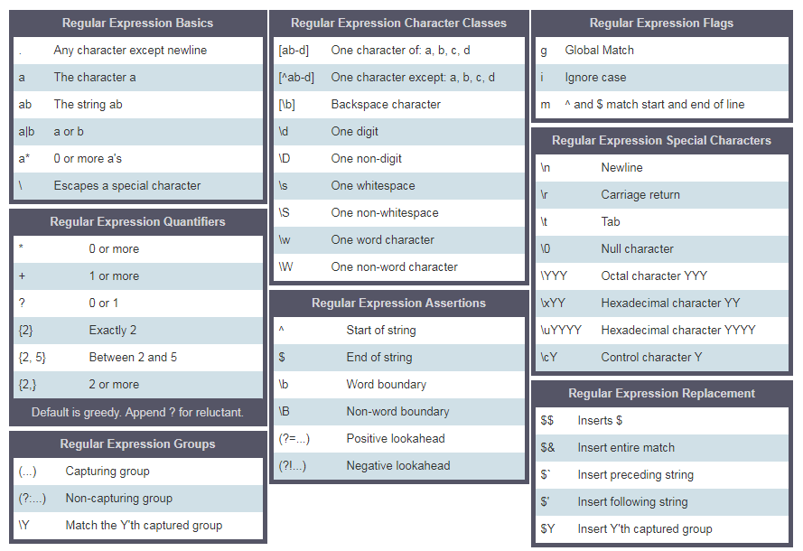

[<< INDICE](../../../index.md)

[<< Día 11](../javascript/dia-11-desestructuracion-y-spreading.md) | [Día 13>>](../javascript/dia-13-metodos-del-objeto-console.md)

- [📘 Día 12](#-día-12)
  - [Expresiones Regulares](#expresiones-regulares)
    - [Parámetros RegExp](#parámetros-regexp)
      - [Patrón](#patrón)
      - [Banderas](#banderas)
    - [Creación de un patrón con el constructor RegExp](#creación-de-un-patrón-con-el-constructor-regexp)
    - [Creación de un patrón sin el constructor RegExp](#creación-de-un-patrón-sin-el-constructor-regexp)
    - [Métodos del objeto RegExp](#métodos-del-objeto-regexp)
      - [Pruebas de coincidencia](#pruebas-de-coincidencia)
      - [Array que contiene todas las coincidencias](#array-que-contiene-todas-las-coincidencias)
      - [Sustitución de una subcadena](#sustitución-de-una-subcadena)
    - [Corchetes](#corchetes)
    - [Caracter Escape (\\) en RegExp](#caracter-escape--en-regexp)
    - [Una o más veces(+)](#una-o-más-veces)
    - [Punto(.)](#punto)
    - [Cero o más veces(\*)](#cero-o-más-veces)
    - [Cero o una vez (?)](#cero-o-una-vez-)
    - [Cuantificador en RegExp](#cuantificador-en-regexp)
    - [Caret ^](#caret-)
    - [Coincidencia exacta](#coincidencia-exacta)
  - [💻 Ejercicios](#-ejercicios)
    - [Ejercicios: Nivel 1](#ejercicios-nivel-1)
    - [Ejercicios: Nivel 2](#ejercicios-nivel-2)
    - [Ejercicios: Nivel 3](#ejercicios-nivel-3)

# 📘 Día 12

## Expresiones Regulares

Una expresión regular o RegExp es un pequeño lenguaje de programación que ayuda a encontrar patrones en los datos. Una RegExp puede ser utilizada para comprobar si algún patrón existe en diferentes tipos de datos. Para usar RegExp en JavaScript, podemos usar el constructor RegExp o podemos declarar un patrón RegExp usando dos barras inclinadas seguidas de una bandera. Podemos crear un patrón de dos maneras.

Para declarar una cadena de caracteres utilizamos una comilla simple, una comilla doble y un signo de retroceso; para declarar una expresión regular utilizamos dos barras inclinadas y una bandera opcional. La bandera puede ser g, i, m, s, u o y.

### Parámetros RegExp

Una expresión regular toma dos parámetros. Un patrón de búsqueda requerido y una bandera opcional.

#### Patrón

Un patrón puede ser un texto o cualquier forma de patrón que tenga algún tipo de similitud. Por ejemplo, la palabra "spam" en un correo electrónico podría ser un patrón que nos interesa buscar en un correo electrónico o un formato de número de teléfono puede ser de nuestro interés para buscar.

#### Banderas

Las banderas son parámetros opcionales en una expresión regular que determinan el tipo de búsqueda. Veamos algunas de las banderas:

- g: una bandera global que significa buscar un patrón en todo el texto
- i: indicador de insensibilidad a las mayúsculas y minúsculas (busca tanto en minúsculas como en mayúsculas)
- m: multilínea

### Creación de un patrón con el constructor RegExp

Declarar una expresión regular sin bandera global y sin distinguir entre mayúsculas y minúsculas.

```js
// sin bandera
let pattern = "love";
let regEx = new RegExp(pattern);
```

Declarar una expresión regular con un indicador global y un indicador de insensibilidad a las mayúsculas y minúsculas.

```js
let pattern = "love";
let flag = "gi";
let regEx = new RegExp(pattern, flag);
```

Declarar un patrón regex usando el objeto RegExp. Escribir el patrón y la bandera dentro del constructor RegExp

```js
let regEx = new RegExp("love", "gi");
```

### Creación de un patrón sin el constructor RegExp

Declarar una expresión regular con un indicador global y un indicador de insensibilidad a las mayúsculas y minúsculas.

```js
let regEx = /love/gi;
```

La expresión regular anterior es la misma que creamos con el constructor RegExp

```js
let regEx = new RegExp("love", "gi");
```

### Métodos del objeto RegExp

Veamos algunos de los métodos RegExp

#### Pruebas de coincidencia

_test()_:Comprueba si hay una coincidencia en una cadena. Devuelve verdadero o falso.

```js
const str = "I love JavaScript";
const pattern = /love/;
const result = pattern.test(str);
console.log(result);
```

```sh
true
```

#### Array que contiene todas las coincidencias

_match()_:Retorna un array que contiene todas las coincidencias, incluyendo los grupos de captura, o null si no se encuentra ninguna coincidencia.
Si no utilizamos una bandera global, match() retorna un array que contiene el patrón, el índice, la entrada y el grupo.

```js
const str = "I love JavaScript";
const pattern = /love/;
const result = str.match(pattern);
console.log(result);
```

```sh
["love", index: 2, input: "I love JavaScript", groups: undefined]
```

```js
const str = "I love JavaScript";
const pattern = /love/g;
const result = str.match(pattern);
console.log(result);
```

```sh
["love"]
```

_search()_: Busca una coincidencia en una cadena. Devuelve el índice de la coincidencia, o -1 si la búsqueda falla.

```js
const str = "I love JavaScript";
const pattern = /love/g;
const result = str.search(pattern);
console.log(result);
```

```sh
2
```

#### Sustitución de una subcadena

_replace()_: Ejecuta una búsqueda de una coincidencia en una cadena, y reemplaza la subcadena coincidente con una subcadena de reemplazo.

```js
const txt =
  "Python es el lenguaje más bello que ha creado el ser humano.\
Recomiendo python para un primer lenguaje de programación";

matchReplaced = txt.replace(/Python|python/, "JavaScript");
console.log(matchReplaced);
```

```sh
JavaScript es el lenguaje más bello que ha creado el ser humano. Recomiendo python como primer lenguaje de programación
```

```js
const txt =
  "Python es el lenguaje más bello que ha creado el ser humano.\
Recomiendo python para un primer lenguaje de programación";

matchReplaced = txt.replace(/Python|python/g, "JavaScript");
console.log(matchReplaced);
```

```sh
JavaScript es el lenguaje más bello que ha creado el ser humano. Recomiendo JavaScript para un primer lenguaje de programación
```

```js
const txt =
  "Python es el lenguaje más bello que ha creado el ser humano.\
Recomiendo python para un primer lenguaje de programación";

matchReplaced = txt.replace(/Python/gi, "JavaScript");
console.log(matchReplaced);
```

```sh
JavaScript es el lenguaje más bello que ha creado el ser humano. Recomiendo JavaScript para un primer lenguaje de programación
```

```js
const txt =
  "%So%y p%r%%of%%es%or%a% y m%e %% enc%an%ta en%se%ña%r.\
N%o h%a%y n%a%d%a mas g%r%at%if%icante q%ue e%d%uc%a%r y c%a%p%ac%i%ta%r %a l%a g%e%n%t%e.\
L%a e%n%%señ%anza m%e %p%ar%ec%e ma%s% i%n%te%r%esa%nt%e que %cu%alq%uie%r %otro t%ra%ba%jo.\
E%s%t%o te mo%ti%v%a a s%er p%ro%fe%sor.";

matches = txt.replace(/%/g, "");
console.log(matches);
```

```sh
Soy profesora y me encanta enseñar. No hay nada más gratificante que educar y capacitar a la gente. La enseñanza me parece más interesante que cualquier otro trabajo. ¿Esto te motiva a ser profesor?
```

- []: Un conjunto de caracteres
  - [a-c] significa, a o b o c
  - [a-z] significa, cualquier letra de la a a la z
  - [A-Z] significa, cualquier carácter de la A a la Z
  - [0-3] significa, 0 o 1 o 2 o 3
  - [0-9] significa cualquier número del 0 al 9
  - [A-Za-z0-9] cualquier carácter que sea de la a a la z, de la A a la Z, del 0 al 9
- \\: utiliza para evadir caracteres especiales
  - \d significa: coincide cuando el string contiene dígitos (numeros del 0-9)
  - \D significa: coincide cuando el string no contiene dígitos
- . : cualquier carácter excepto la nueva línea (\n)
- ^: comienza con
  - r'^substring' eg r'^love', una frase que comienza con la palabra love
  - r'[^abc] significa no a, no b, no c.
- $: termina con
  - r'substring$' eg r'love$', la frase termina con una palabra love
- \*: cero o más veces
  - r'[a]\*' significa un opcional o puede ocurrir muchas veces.
- +: una o más veces
  - r'[a]+' significa al menos una o más veces
- ?: cero o una vez
  - r'[a]?' significa cero veces o una vez
- \b: Buscador de palabras, coincide con el principio o el final de una palabra
- {3}: Exactamente 3 caracteres
- {3,}: Al menos 3 caracteres
- {3,8}: De 3 a 8 caracteres
- |: O bien
  - r'apple|banana' significa tanto una manzana como un plátano
- (): Capturar y agrupar



Usemos un ejemplo para aclarar los metacaracteres anteriores

### Corchetes

Usemos el corchete para incluir las minúsculas y las mayúsculas

```js
const pattern = "[Aa]pple"; // este corchete significa A o a
const txt =
  "Apple and banana are fruits. An old cliche says an apple a day keeps the  doctor way has been replaced by a banana a day keeps the doctor far far away. ";
const matches = txt.match(pattern);

console.log(matches);
```

```sh
["Apple", index: 0, input: "Apple and banana are fruits. An old cliche says an apple a day keeps the  doctor way has been replaced by a banana a day keeps the doctor far far away.", groups: undefined]

```

```js
const pattern = /[Aa]pple/g; // este corchete significa A o a
const txt =
  "Apple and banana are fruits. An old cliche says an apple a day a doctor way has been replaced by a banana a day keeps the doctor far far away. ";
const matches = txt.match(pattern);

console.log(matches);
```

```sh
["Apple", "apple"]
```

Si queremos buscar la banana, escribimos el patrón de la siguiente manera:

```js
const pattern = /[Aa]pple|[Bb]anana/g; // este corchete significa A o a
const txt =
  "Apple and banana are fruits. An old cliche says an apple a day a doctor way has been replaced by a banana a day keeps the doctor far far away. Banana is easy to eat too.";
const matches = txt.match(pattern);

console.log(matches);
```

```sh
["Apple", "banana", "apple", "banana", "Banana"]
```

Utilizando el corchete y el operador or , conseguimos extraer Apple, apple, Banana y banana.

### Caracter Escape (\\) en RegExp

```js
const pattern = /\d/g; // d es un carácter especial que significa dígitos
const txt = "This regular expression example was made in January 12,  2020.";
const matches = txt.match(pattern);

console.log(matches); // ["1", "2", "2", "0", "2", "0"], esto es lo que no queremos
```

```js
const pattern = /\d+/g; // d es un carácter especial que significa dígitos
const txt = "This regular expression example was made in January 12,  2020.";
const matches = txt.match(pattern);

console.log(matches); // ["12", "2020"], esto es lo que no queremos
```

### Una o más veces(+)

```js
const pattern = /\d+/g; // d es un carácter especial que significa dígitos
const txt = "This regular expression example was made in January 12,  2020.";
const matches = txt.match(pattern);
console.log(matches); // ["12", "2020"], esto es lo que no queremos
```

### Punto(.)

```js
const pattern = /[a]./g; // este corchete significa a y . significa cualquier carácter excepto nueva línea
const txt = "Apple and banana are fruits";
const matches = txt.match(pattern);

console.log(matches); // ["an", "an", "an", "a ", "ar"]
```

```js
const pattern = /[a].+/g; // . cualquier carácter, + cualquier carácter una o más veces
const txt = "Apple and banana are fruits";
const matches = txt.match(pattern);

console.log(matches); // ['and banana are fruits']
```

### Cero o más veces(\*)

Cero o muchas veces. El patrón puede no ocurrir o puede ocurrir muchas veces.

```js
const pattern = /[a].*/g; //. cualquier carácter, + cualquier carácter una o más veces
const txt = "Apple and banana are fruits";
const matches = txt.match(pattern);

console.log(matches); // ['and banana are fruits']
```

### Cero o una vez (?)

Cero o una vez. El patrón puede no ocurrir o puede ocurrir una vez.

```js
const txt =
  "I am not sure if there is a convention how to write the word e-mail.\
Some people write it email others may write it as Email or E-mail.";
const pattern = /[Ee]-?mail/g; // ? significa que es opcional
matches = txt.match(pattern);

console.log(matches); // ["e-mail", "email", "Email", "E-mail"]
```

### Cuantificador en RegExp

Podemos especificar la longitud de la subcadena que buscamos en un texto, utilizando una llave. Veamos cómo utilizar los cuantificadores RegExp. Imaginemos que estamos interesados en una subcadena cuya longitud es de 4 caracteres

```js
const txt = "This regular expression example was made in December 6,  2019.";
const pattern = /\\b\w{4}\b/g; //  palabras de cuatro caracteres exactamente
const matches = txt.match(pattern);
console.log(matches); //['This', 'made', '2019']
```

```js
const txt = "This regular expression example was made in December 6,  2019.";
const pattern = /\b[a-zA-Z]{4}\b/g; //  palabras de cuatro caracteres exactos sin números
const matches = txt.match(pattern);
console.log(matches); //['This', 'made']
```

```js
const txt = "This regular expression example was made in December 6,  2019.";
const pattern = /\d{4}/g; // un número y exactamente cuatro dígitos
const matches = txt.match(pattern);
console.log(matches); // ['2019']
```

```js
const txt = "This regular expression example was made in December 6,  2019.";
const pattern = /\d{1,4}/g; // 1 to 4
const matches = txt.match(pattern);
console.log(matches); // ['6', '2019']
```

### Caret ^

- Comienza con

```js
const txt = "This regular expression example was made in December 6,  2019.";
const pattern = /^This/; // ^ significa que comienza con
const matches = txt.match(pattern);
console.log(matches); // ['This']
```

- Negación

```js
const txt = "This regular expression example was made in December 6,  2019.";
const pattern = /[^A-Za-z,. ]+/g; // ^ en un conjunto de caracteres significa negación, no de la A a la Z, no de la a a la z, sin espacio, sin coma y sin punto
const matches = txt.match(pattern);
console.log(matches); // ["6", "2019"]
```

### Coincidencia exacta

Debe tener ^ que empieza y $ que es el final.

```js
let pattern = /^[A-Z][a-z]{3,12}$/;
let name = "Asabeneh";
let result = pattern.test(name);

console.log(result); // true
```

🌕 Estás llegando lejos. Sigue avanzando. Ahora, estás súper cargado con el poder de la expresión regular. Tienes el poder de extraer y limpiar cualquier tipo de texto y puedes dar sentido a los datos no estructurados. Acabas de completar los retos del día 12 y llevas 12 pasos de tu camino a la grandeza. Ahora haz algunos ejercicios para tu cerebro y para tus músculos.

## 💻 Ejercicios

### Ejercicios: Nivel 1

1. Calcula los ingresos anuales totales de la persona a partir del siguiente texto. 'Gana 4000 euros de sueldo al mes, 10000 euros de bonificación anual, 5500 euros de cursos online al mes'.
1. La posición de algunas partículas en el eje horizontal x -12, -4, -3 y -1 en la dirección negativa, 0 en el origen, 4 y 8 en la dirección positiva. Extrae estos números y encuentra la distancia entre las dos partes más lejanas.

```js
points = ["-1", "2", "-4", "-3", "-1", "0", "4", "8"];
sortedPoints = [-4, -3, -1, -1, 0, 2, 4, 8];
distance = 12;
```

1. Escribir un patrón que identifique si una cadena es una variable JavaScript válida

   ```sh
   is_valid_variable('first_name') # True
   is_valid_variable('first-name') # False
   is_valid_variable('1first_name') # False
   is_valid_variable('firstname') # True
   ```

### Ejercicios: Nivel 2

1. Escriba una función llamada _tenMostFrequentWords_ que obtenga las diez palabras más frecuentes de una cadena?

   ```js
   paragraph = `I love teaching. If you do not love teaching what else can you love. I love Python if you do not love something which can give you all the capabilities to develop an application what else can you love.`;
   console.log(tenMostFrequentWords(paragraph));
   ```

   ```sh
       [
       {word:'love', count:6},
       {word:'you', count:5},
       {word:'can', count:3},
       {word:'what', count:2},
       {word:'teaching', count:2},
       {word:'not', count:2},
       {word:'else', count:2},
       {word:'do', count:2},
       {word:'I', count:2},
       {word:'which', count:1},
       {word:'to', count:1},
       {word:'the', count:1},
       {word:'something', count:1},
       {word:'if', count:1},
       {word:'give', count:1},
       {word:'develop',count:1},
       {word:'capabilities',count:1},
       {word:'application', count:1},
       {word:'an',count:1},
       {word:'all',count:1},
       {word:'Python',count:1},
       {word:'If',count:1}]
   ```

   ```js
   console.log(tenMostFrequentWords(paragraph, 10));
   ```

   ```sh
   [{word:'love', count:6},
   {word:'you', count:5},
   {word:'can', count:3},
   {word:'what', count:2},
   {word:'teaching', count:2},
   {word:'not', count:2},
   {word:'else', count:2},
   {word:'do', count:2},
   {word:'I', count:2},
   {word:'which', count:1}
   ]
   ```

### Ejercicios: Nivel 3

1. Escribe una función que limpie el texto. Limpia el siguiente texto. Después de la limpieza, cuente tres palabras más frecuentes en la cadena.

```js
sentence = `%I $am@% a %tea@cher%, &and& I lo%#ve %tea@ching%;. There $is nothing; &as& mo@re rewarding as educa@ting &and& @emp%o@wering peo@ple. ;I found tea@ching m%o@re interesting tha@n any other %jo@bs. %Do@es thi%s mo@tivate yo@u to be a tea@cher!?`;
console.log(cleanText(sentence));
```

````sh
 I am a teacher and I love teaching There is nothing as more rewarding as educating and empowering people I found teaching more interesting than any other jobs Does this motivate you to be a teacher
 ```
2. Escriba una función que encuentre las palabras más frecuentes. Después de la limpieza, cuente tres palabras más frecuentes en la cadena.

```js
 console.log(mostFrequentWords(cleanedText))
 [{word:'I', count:3}, {word:'teaching', count:2}, {word:'teacher', count:2}]
````

🎉 ¡FELICITACIONES! 🎉

[<< Día 11](../javascript/dia-11-desestructuracion-y-spreading.md) | [Día 13 >>](../javascript/dia-13-metodos-del-objeto-console.md)

[<< INDICE](../../../index.md)