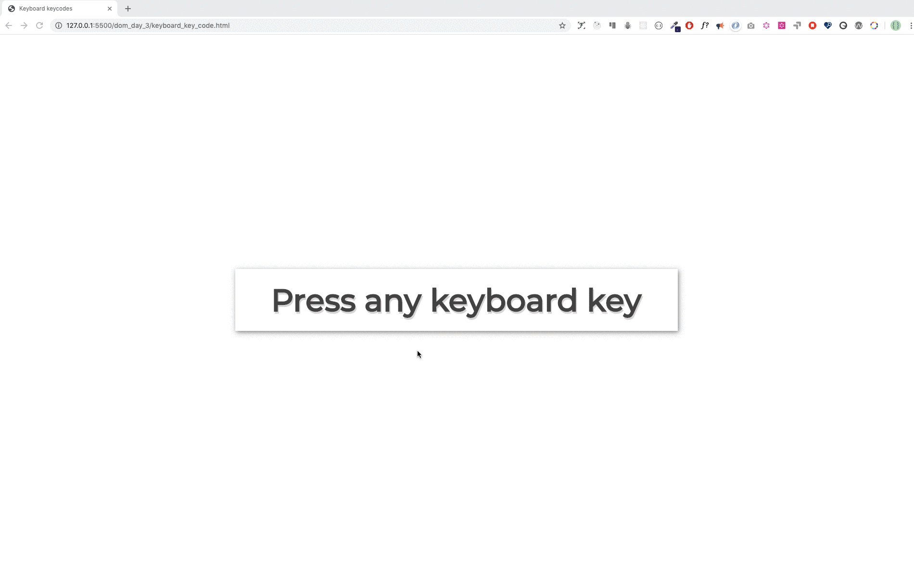

[<< INDICE](../../../index.md)

[<< Día 22](../javascript/dia-22-manipulacion-del-objeto-dom.md) | [Día 24 >>](../javascript/dia-24-proyecto-sistema-solar.md)

- [Día 23](#día-23)
  - [DOM(Document Object Model)-Día 3](#domdocument-object-model-día-3)
    - [Event Listeners](#event-listeners)
      - [Click](#click)
      - [Doble Click](#doble-click)
      - [Mouse enter](#mouse-enter)
    - [Obtener el valor de un elemento input](#obtener-el-valor-de-un-elemento-input)
    - [valor de entrada](#valor-de-entrada)
      - [evento de entrada y cambio](#evento-de-entrada-y-cambio)
      - [evento de desenfoque](#evento-de-desenfoque)
      - [keypress, keydow y keyup](#keypress-keydow-y-keyup)
  - [Ejercicios](#ejercicios)
    - [Ejercicios: Nivel 1](#ejercicios-nivel-1)

# Día 23

## DOM(Document Object Model)-Día 3

### Event Listeners

Eventos HTML comunes: onclick, onchange, onmouseover, onmouseout, onkeydown, onkeyup, onload.
Podemos añadir el método **event_listener** (escuchador de eventos) a cualquier objeto DOM. Utilizamos el método **_addEventListener()_** para escuchar diferentes tipos de eventos en los elementos HTML. El método _addEventListener()_ toma dos argumentos, un event listener y una función callback.

```js
selectedElement.addEventListener("eventlistner", function (e) {
  // la actividad que quieres que ocurra después del evento estará aquí
});
// or

selectedElement.addEventListener("eventlistner", (e) => {
  // la actividad que quieres que ocurra después del evento estará aquí
});
```

#### Click

Para adjuntar un event listener a un elemento, primero seleccionamos el elemento y luego adjuntamos el método addEventListener. El event listener toma como argumento el tipo de evento y las funciones de callback.

El siguiente es un ejemplo de evento de tipo click.

**Ejemplo: click**

```html
<!DOCTYPE html>
<html>
  <head>
    <title>Document Object Model</title>
  </head>

  <body>
    <button>Click Me</button>

    <script>
      const button = document.querySelector("button");
      button.addEventListener("click", (e) => {
        console.log("e gives the event listener object:", e);
        console.log("e.target gives the selected element: ", e.target);
        console.log(
          "e.target.textContent gives content of selected element: ",
          e.target.textContent
        );
      });
    </script>
  </body>
</html>
```

También se puede adjuntar un evento directamente al elemento HTML como script en línea.

**Ejemplo: onclick**

```html
<!DOCTYPE html>
<html>
  <head>
    <title>Document Object Model</title>
  </head>

  <body>
    <button onclick="clickMe()">Click Me</button>
    <script>
      const clickMe = () => {
        alert("We can attach event on HTML element");
      };
    </script>
  </body>
</html>
```

#### Doble Click

Para adjuntar un event listener a un elemento, primero seleccionamos el elemento y luego adjuntamos el método addEventListener. El event listener toma como argumento el tipo de evento y las funciones de callback.

El siguiente es un ejemplo de evento de tipo click.

**Ejemplo: dblclick**

```html
<!DOCTYPE html>
<html>
  <head>
    <title>Document Object Model</title>
  </head>

  <body>
    <button>Click Me</button>
    <script>
      const button = document.querySelector("button");
      button.addEventListener("dblclick", (e) => {
        console.log("e gives the event listener object:", e);
        console.log("e.target gives the selected element: ", e.target);
        console.log(
          "e.target.textContent gives content of selected element: ",
          e.target.textContent
        );
      });
    </script>
  </body>
</html>
```

#### Mouse enter

Para adjuntar un event listener a un elemento, primero seleccionamos el elemento y luego adjuntamos el método addEventListener. El event listener toma como argumento el tipo de evento y las funciones de callback.

El siguiente es un ejemplo de evento de tipo click.

**Ejemplo: mouseenter**

```html
<!DOCTYPE html>
<html>
  <head>
    <title>Document Object Model</title>
  </head>

  <body>
    <button>Click Me</button>
    <script>
      const button = document.querySelector("button");
      button.addEventListener("mouseenter", (e) => {
        console.log("e gives the event listener object:", e);
        console.log("e.target gives the selected element: ", e.target);
        console.log(
          "e.target.textContent gives content of selected element: ",
          e.target.textContent
        );
      });
    </script>
  </body>
</html>
```

A estas alturas ya estás familiarizado con el método addEventListen y cómo añadir un event listener. Hay muchos tipos de event listeners. Pero en este reto nos centraremos en los eventos importantes más comunes.

Lista de eventos:

- click - cuando se hace click en el elemento
- dblclick - cuando se hace doble click en el elemento
- mouseenter - cuando el punto del mouse ingresa al elemento
- mouseleave - cuando el puntero del mouse abandona el elemento
- mousemove - cuando el puntero del mouse se mueve sobre el elemento
- mouseover - cuando el puntero del mouse se mueve sobre el elemento
- mouseout - cuando el puntero del mouse sale del elemento
- input - cuando el valor entra en el input de entrada
- change - cuando el valor cambia en el input de entrada
- blur - cuando el elemento no está enfocado
- keydown - cuando una tecla está pulsada
- keyup - cuando una tecla está levantada
- keypress - cuando pulsamos cualquier tecla
- onload - cuando el navegador ha terminado de cargar una página

Pruebe los tipos de eventos anteriores sustituyendo el tipo de evento en el fragmento de código anterior.

### Obtener el valor de un elemento input

Normalmente rellenamos formularios y los formularios aceptan datos. Los campos de los formularios se crean utilizando el elemento HTML input. Vamos a construir una pequeña aplicación que nos permita calcular el índice de masa corporal de una persona utilizando dos campos de entrada, un botón y una etiqueta p.

### valor de entrada

```html
<!DOCTYPE html>
<html>
  <head>
    <title>Document Object Model:30 Days Of JavaScript</title>
  </head>

  <body>
    <h1>Body Mass Index Calculator</h1>

    <input type="text" id="mass" placeholder="Mass in Kilogram" />
    <input type="text" id="height" placeholder="Height in meters" />
    <button>Calculate BMI</button>

    <script>
      const mass = document.querySelector("#mass");
      const height = document.querySelector("#height");
      const button = document.querySelector("button");

      let bmi;
      button.addEventListener("click", () => {
        bmi = mass.value / height.value ** 2;
        alert(`your bmi is ${bmi.toFixed(2)}`);
        console.log(bmi);
      });
    </script>
  </body>
</html>
```

#### evento de entrada y cambio

En el ejemplo anterior, hemos conseguido obtener los valores de entrada de dos campos de entrada haciendo click en el botón. Qué tal si queremos obtener el valor sin hacer click en el botón. Podemos utilizar el tipo de evento _change_ o _input_ para obtener los datos inmediatamente del campo de entrada cuando el campo está en el foco. Veamos cómo lo haremos.

```html
<!DOCTYPE html>
<html>
  <head>
    <title>Document Object Model:30 Days Of JavaScript</title>
  </head>

  <body>
    <h1>Data Binding using input or change event</h1>

    <input type="text" placeholder="say something" />
    <p></p>

    <script>
      const input = document.querySelector("input");
      const p = document.querySelector("p");

      input.addEventListener("input", (e) => {
        p.textContent = e.target.value;
      });
    </script>
  </body>
</html>
```

#### evento de desenfoque

A diferencia de _input_ o _change_, el evento _blur_ se produce cuando el campo de entrada no está enfocado.

```js
<!DOCTYPE html>
<html>

<head>
    <title>Document Object Model:30 Days Of JavaScript</title>
</head>

<body>
    <h1>Giving feedback using blur event</h1>

    <input type="text" id="mass" placeholder="say something" />
    <p></p>

    <script>
        const input = document.querySelector('input')
        const p = document.querySelector('p')

        input.addEventListener('blur', (e) => {
            p.textContent = 'Field is required'
            p.style.color = 'red'

        })
    </script>
</body>

</html>
```

#### keypress, keydow y keyup

Podemos acceder a todos los números de teclas del teclado utilizando diferentes tipos de event listener. Usemos keypress y obtengamos el keyCode de cada tecla del teclado.

```html
<!DOCTYPE html>
<html>
  <head>
    <title>Document Object Model:30 Days Of JavaScript</title>
  </head>

  <body>
    <h1>Key events: Press any key</h1>

    <script>
      document.body.addEventListener("keypress", (e) => {
        alert(e.keyCode);
      });
    </script>
  </body>
</html>
```

---

🌕 Eres muy especial, estás progresando cada día. Ahora, sabes cómo manejar cualquier tipo de eventos DOM. . Te quedan sólo siete días para tu camino a la grandeza. Ahora haz algunos ejercicios para tu cerebro y para tus músculos.

## Ejercicios

### Ejercicios: Nivel 1

1. Generar números y marcar pares, impares y primos con tres colores diferentes. Vea la imagen de abajo.


1. Generando el código del teclado usando even listener. La imagen de abajo.



🎉 ¡FELICITACIONES! 🎉

[<< Día 22](../javascript/dia-22-manipulacion-del-objeto-dom.md) | [Día 24 >>](../javascript/dia-24-proyecto-sistema-solar.md)

[<< INDICE](../../../index.md)