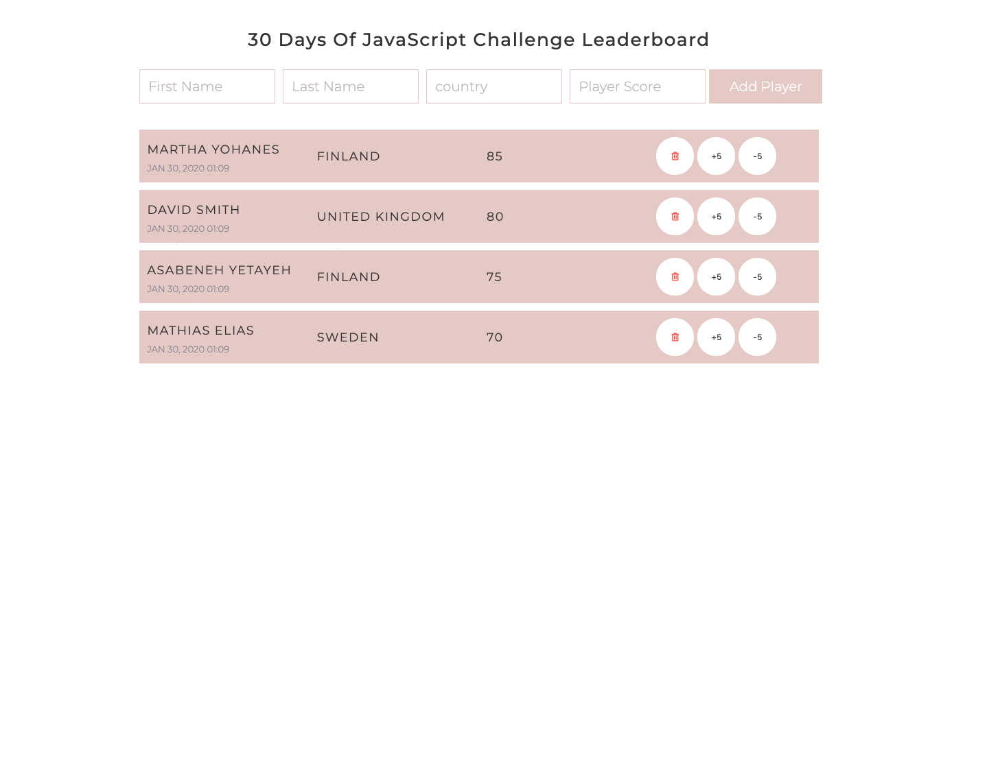

[<< INDICE](../../../index.md)

[<< Día 27](../javascript/day-mini-project-portfolio.md) | [Día 29>>](../javascript/dia-29-mini-proyecto-animacion-de-caracteres.md)

- [Día 28](#día-28)
  - [Ejercicio](#ejercicio)
    - [Ejercicio: Nivel 1](#ejercicio-nivel-1)

# Día 28

## Ejercicio

### Ejercicio: Nivel 1

1. Crea lo siguiente usando HTML, CSS y JavaScript

🎉 ¡FELICITACIONES! 🎉

[<< Día 27](../javascript/day-mini-project-portfolio.md) | [Día 29>>](../javascript/dia-29-mini-proyecto-animacion-de-caracteres.md)

[<< INDICE](../../../index.md)
